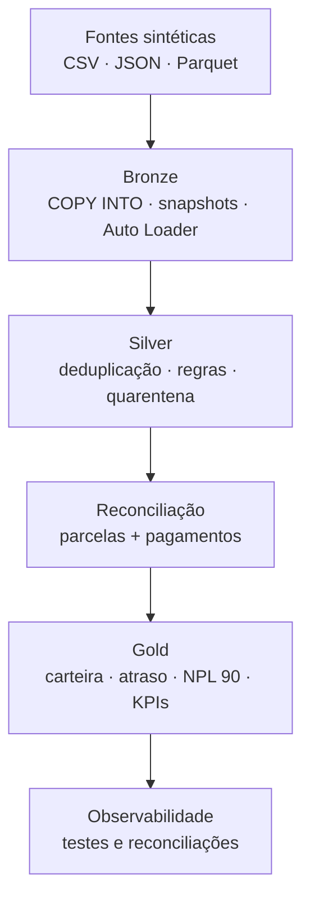

# CredLake — Credit Portfolio Analytics on Databricks

Projeto Lakehouse de engenharia de dados para uma carteira de crédito sintética. O pipeline recebe cadastros, contratos, parcelas e eventos de pagamento, aplica controles auditáveis e publica indicadores financeiros para acompanhamento de saldo, atraso e inadimplência.

O objetivo não é apenas demonstrar notebooks. O repositório mostra decisões que aparecem em ambientes reais: diferentes padrões de ingestão, idempotência, schema enforcement, deduplicação, quarentena, reconciliação financeira, governança, observabilidade e orquestração.

> Todos os dados são sintéticos. Nenhum documento, nome ou e-mail representa uma pessoa real.

## Resultado

O fluxo publica:

- 2.000 clientes e 5 produtos;
- 5.000 contratos válidos;
- contratos e pagamentos rejeitados em quarentenas auditáveis;
- uma posição financeira por parcela;
- uma posição consolidada por contrato;
- KPIs por produto, estado e classificação de risco;
- histórico de testes de qualidade em `ops.data_quality_results`.

## Arquitetura



| Origem | Formato | Padrão de ingestão | Motivo |
|---|---|---|---|
| Produtos e contratos | CSV | `COPY INTO` | Carga batch incremental e idempotente por arquivo |
| Clientes | JSON | Snapshot com `replaceWhere` | Substituição atômica de uma data de referência |
| Parcelas | Parquet | Snapshot com `replaceWhere` | Preservação do schema tipado do arquivo |
| Pagamentos | JSON | Auto Loader + `availableNow` | Descoberta incremental, checkpoint e coluna de resgate |

## Regras que o projeto comprova

A origem injeta deliberadamente cinco problemas:

1. um contrato duplicado;
2. um contrato com principal negativo;
3. um contrato com cliente inexistente;
4. um pagamento duplicado;
5. um pagamento com valor nulo.

A Bronze preserva esses registros. A Silver publica apenas entidades confiáveis e envia os rejeitados para tabelas de quarentena com `error_codes` e `error_reasons`. A Gold não expõe nome, documento ou e-mail.

## Estrutura

```text
.
├── databricks.yml                 # bundle e ambientes
├── resources/
│   └── credlake_job.yml           # DAG do Lakeflow Job
├── src/credlake/
│   ├── 00_setup.py
│   ├── 01_generate_source_data.py
│   ├── 02_bronze_batch.py
│   ├── 03_bronze_snapshots.py
│   ├── 04_bronze_payments.py
│   ├── 05_silver_dimensions.py
│   ├── 06_silver_contracts.py
│   ├── 07_silver_payments.py
│   ├── 08_silver_installments.py
│   ├── 09_gold_portfolio.py
│   ├── 10_quality_observability.py
│   └── 99_reset_demo.py           # utilitário manual, fora do job
├── sql/
│   └── portfolio_analysis.sql
├── docs/
│   ├── architecture.md
│   ├── data_dictionary.md
│   ├── interview-guide.md
│   └── runbook.md
└── tests/
    └── test_repository_contract.py
```

Os arquivos `.ipynb` na raiz registram a primeira versão construída de forma guiada. O fluxo canônico e orquestrado está em `src/credlake`.

## Execução rápida pelo Databricks Git Folder

Se você já executou os notebooks antigos, comece pelo procedimento controlado de reset descrito em [docs/runbook.md](docs/runbook.md). Em um ambiente limpo:

1. abra `src/credlake/00_setup.py` e execute;
2. execute os notebooks `01` a `10` na ordem numérica;
3. `02`, `03` e `04` podem rodar em paralelo;
4. consulte `credlake.gold.vw_executive_portfolio`;
5. confirme que todos os testes em `credlake.ops.data_quality_results` passaram.

## Execução como bundle

Com o Databricks CLI autenticado:

```bash
databricks bundle validate -t dev
databricks bundle deploy -t dev
databricks bundle run credlake_end_to_end -t dev
```

O job usa tarefas serverless quando esse é o compute padrão disponível no workspace. Não existem tokens ou credenciais no repositório.

## Modelo financeiro

O projeto usa a data do snapshot, e não o relógio do dia da execução, para tornar os indicadores reproduzíveis.

Para cada parcela:

```text
total_paid        = soma dos pagamentos válidos até a data de referência
outstanding       = max(scheduled_amount - total_paid, 0)
days_past_due     = data de referência - vencimento, quando há saldo vencido
overpaid_amount   = max(total_paid - scheduled_amount, 0)
```

Para cada contrato, as parcelas são agregadas e classificadas em:

- `CURRENT`;
- `DPD_01_30`;
- `DPD_31_60`;
- `DPD_61_90`;
- `DPD_90_PLUS`.

`NPL 90` representa contratos com mais de 90 dias de atraso.

## Competências demonstradas

- PySpark e Spark SQL;
- Delta Lake e Unity Catalog;
- arquitetura Medallion;
- `COPY INTO`, Auto Loader e Structured Streaming;
- schemas explícitos, `_metadata` e `_rescued_data`;
- `MERGE`, `replaceWhere`, checkpoints e idempotência;
- qualidade de dados e quarentena;
- modelagem dimensional e indicadores financeiros;
- Lakeflow Jobs e Declarative Automation Bundles;
- Git, testes estáticos e GitHub Actions.

## Decisões e limitações

- Valores monetários são convertidos para `DECIMAL`, evitando aritmética financeira em ponto flutuante.
- As tabelas pequenas não são particionadas. Em escala maior, a primeira opção a avaliar é liquid clustering.
- O modelo de juros sintético usa juros simples apenas para viabilizar o exercício; não representa amortização Price ou SAC.
- A Gold representa a posição atual do snapshot. SCD Tipo 2 e múltiplas datas podem ser adicionadas sem alterar a separação de camadas.
- O CI valida estrutura, sintaxe Python, referências do job e ausência de credenciais. A execução Spark precisa ocorrer no Databricks.

Mais detalhes estão em [arquitetura](docs/architecture.md), [dicionário de dados](docs/data_dictionary.md), [runbook](docs/runbook.md) e [guia de entrevista](docs/interview-guide.md).

## Autor

Lucas Vidal Silva — Engenharia de Dados  
[GitHub](https://github.com/lucasvidalsilva)

